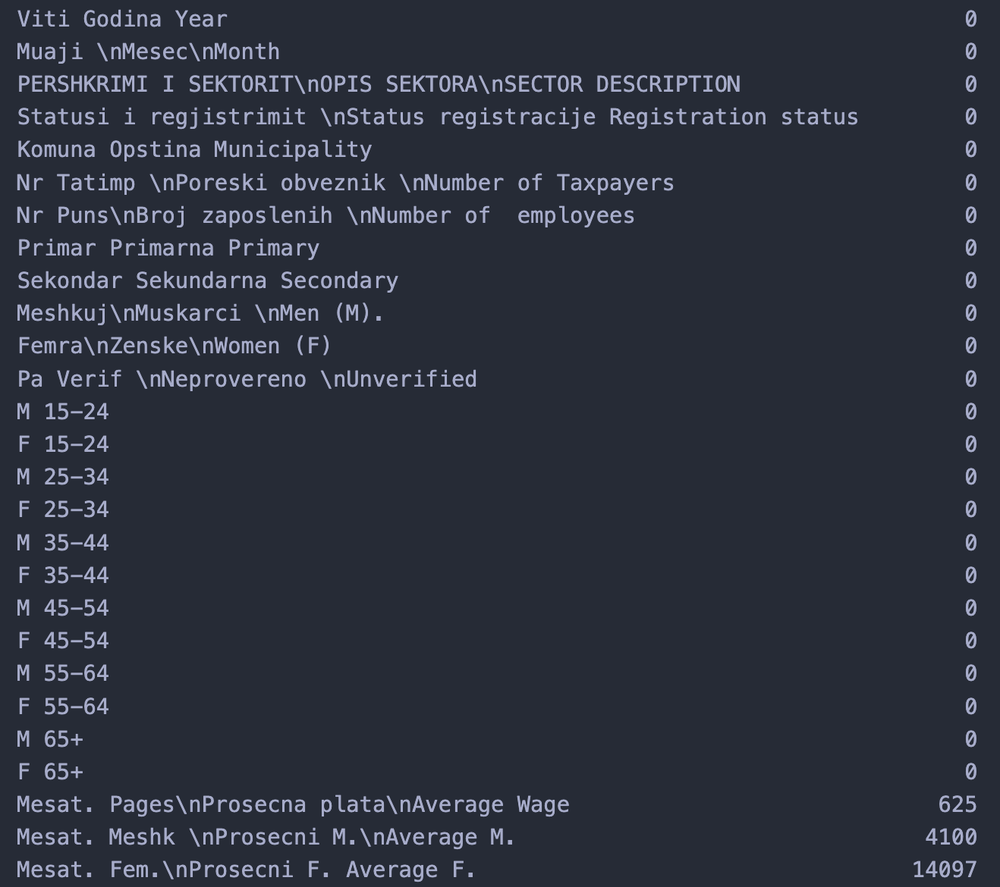
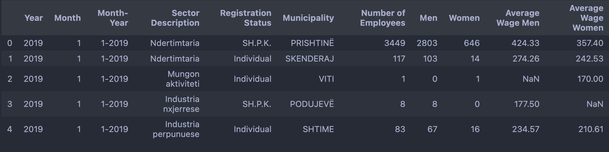
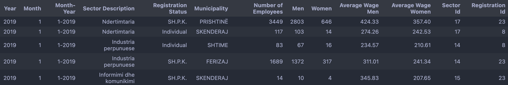
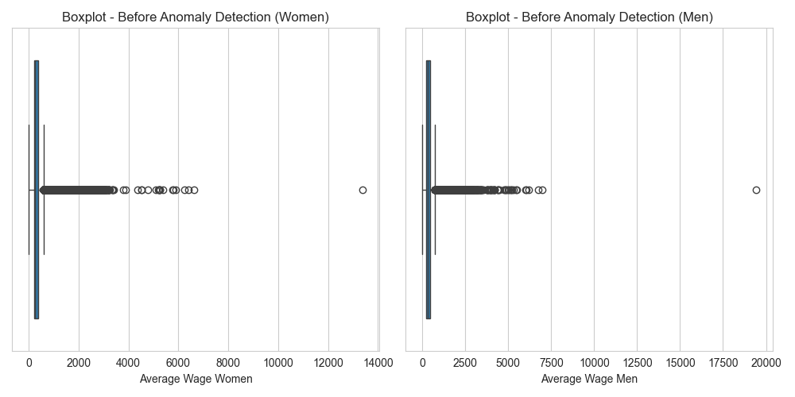
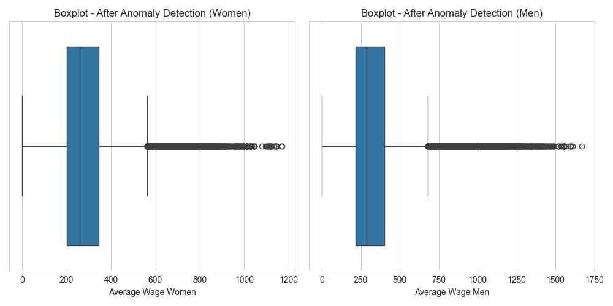
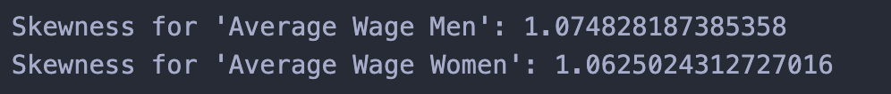
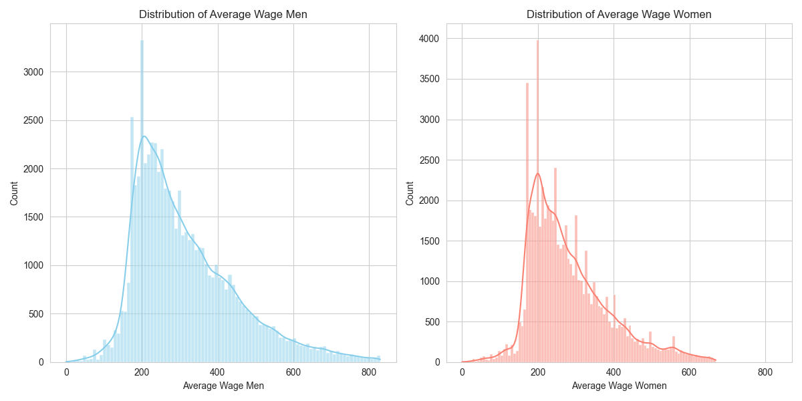
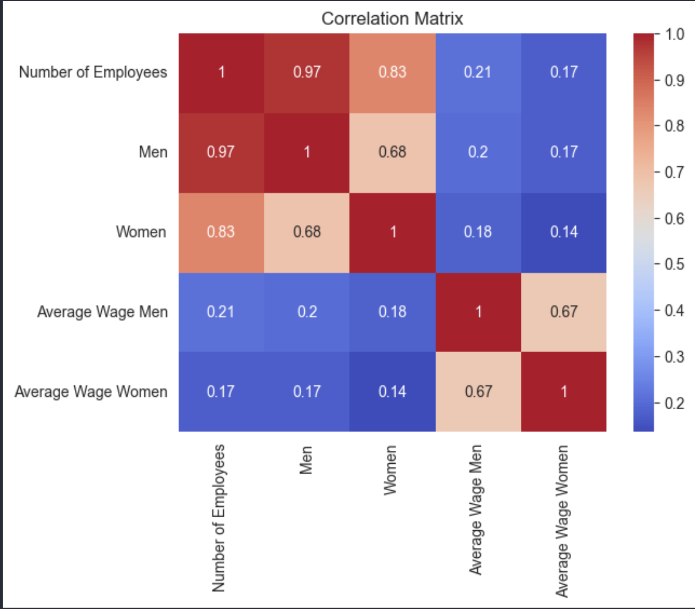
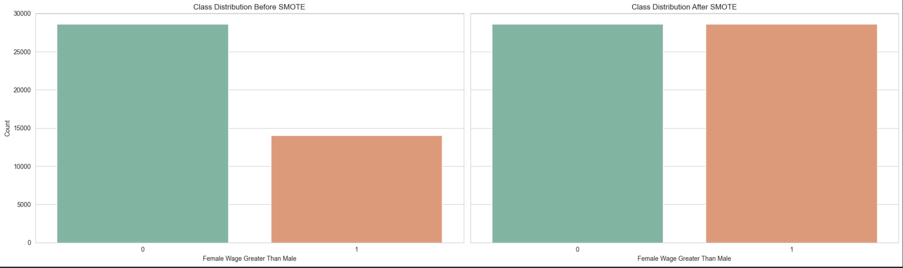

# Employment Salary Prediction

## About

- <strong>University: </strong>University of Prishtina
- <strong>Faculty: </strong>Faculty of Electrical and Computer Engineering
- <strong>Study Program: </strong>Master of Computer and Software Engineering
- <strong>Subject (1st year): </strong>Machine Learning taught by [Prof. Dr. Eng. Lule Ahmedi](https://staff.uni-pr.edu/profile/luleahmedi) and [PhD. c Mërgim Hoti](https://staff.uni-pr.edu/profile/m%C3%ABrgimhoti)
- <strong>Students:</strong> [Festina Qorrolli](https://github.com/festinaqorrolli) and [Fisnik Spahija](https://github.com/Fisinik/)

The goal of this [project](https://github.com/fisinik/employment-salary-prediction) is to predict the male/female employment salary based on the data provided by [Tax Administration of Kosovo](https://www.atk-ks.org/en/open-data/). This project is used for the Machine Learning course in University of Prishtina, Computer and Software Engineering.

## Instructions

This project requires venv environment. This can be done by creating a workspace environment through VScode. Make sure python and pip are installed.

Install kernel for the environment by running the following command in the terminal:

```bash
pip install ipykernel
```

Install the necessary packages.

```bash
pip install -r requirements.txt
```

## Phase 1 (Preparing the model)

### Dataset overview

#### Attributes (27):

- Viti Godina Year <strong>(categorical ordinal)</strong>
- "Muaji
  Mesec
  Month" <strong>(categorical ordinal)</strong>
- "PERSHKRIMI I SEKTORIT
  OPIS SEKTORA
  SECTOR DESCRIPTION" <strong>(categorical nominal)</strong>
- "Statusi i regjistrimit
  Status registracije Registration status" <strong>(categorical nominal)</strong>
- Komuna Opstina Municipality <strong>(categorical nominal)</strong>
- "Nr Tatimp
  Poreski obveznik
  Number of Taxpayers" <strong>(numerical discrete)</strong>
- "Nr Puns
  Broj zaposlenih
  Number of employees" <strong>(numerical discrete)</strong>
- Primar Primarna Primary <strong>(numerical discrete)</strong>
- Sekondar Sekundarna Secondary <strong>(numerical discrete)</strong>
- "Meshkuj
  Muskarci
  Men (M)." <strong>(numerical discrete)</strong>
- "Femra
  Zenske
  Women (F)" <strong>(numerical discrete)</strong>
- "Pa Verif
  Neprovereno
  Unverified" <strong>(numerical discrete)</strong>
- M 15-24 <strong>(numerical discrete)</strong>
- F 15-24 <strong>(numerical discrete)</strong>
- M 25-34 <strong>(numerical discrete)</strong>
- F 25-34 <strong>(numerical discrete)</strong>
- M 35-44 <strong>(numerical discrete)</strong>
- F 35-44 <strong>(numerical discrete)</strong>
- M 45-54 <strong>(numerical discrete)</strong>
- F 45-54 <strong>(numerical discrete)</strong>
- M 55-64 <strong>(numerical discrete)</strong>
- F 55-64 <strong>(numerical discrete)</strong>
- M 65+ <strong>(numerical discrete)</strong>
- F 65+ <strong>(numerical discrete)</strong>
- "Mesat. Pages
  Prosecna plata
  Average Wage" <strong>(numerical continuous)</strong>
- "Mesat. Meshk
  Prosecni M.
  Average M." <strong>(numerical continuous)</strong>
- "Mesat. Fem.
  Prosecni F. Average F." <strong>(numerical continuous)</strong>

#### Data integration

Our dataset is separated based on years of employment data on 5 CSV (Comma Separated Values) files. The files can be found on the link provided on the about section. Using pandas python package we have read and concatinated the 5 csv files into one dataframe "employment_combined".

#### Dataset Size

The resulting dataframe consists of <strong>88014 rows</strong> spaned through 5 years divided into <strong>27 attributes</strong> as described above.

#### Null values



### Dimension reduction and agreggation

Since the attributes are described in three languages, for simplicity's sake we have changed the column names to the corresponding English representation.

Noticing how columns "Men" and "Women" don't have an accurate summary of the age group columns, we have dropped the Men, Women columns and have added the accurate summaries from the age group columns.

Furthermore, columns such as Number of Taxpayers, Primary, Secondary, Unverified, Average wage, have been removed in the context of our objectives stated in the about section.

After these modifications our dataframe consists of the following columns:

- Year <strong>(categorical ordinal)</strong>
- Month <strong>(categorical ordinal)</strong>
- Month-Year <strong>(categorical ordinal)</strong>
- Sector Description <strong>(categorical nominal)</strong>
- Registration Status <strong>(categorical nominal)</strong>
- Municipality <strong>(categorical nominal)</strong>
- Number of Employees <strong>(numerical discrete)</strong>
- Men <strong>(numerical discrete)</strong>
- Women <strong>(numerical discrete)</strong>
- Average Wage Men <strong>(numerical continuous)</strong>
- Average Wage Women <strong>(numerical continuous)</strong>



### Data cleaning

By default values in columns "Average Wage Men" and "Average Wage Women" are NaN if there isn't a male/female employee in that instance. Therefore we fill these columns where values are missing with zeros only if the corresponding Men/Women column has zero value also.

After cleaning these columns our dataset consists of <strong>70611 cleaned rows</strong>.

### Discretization of "Registration Status" and "Sector Description"

As seen on the preprocessing file, we notice that column "Registration Status" has <strong>30 unique string values</strong> whereas 'Sector Description' has <strong>22 unique string values</strong>. We have created two new columns "Registration Id" and "Sector Id" to apply discretization of these columns.



### Anomaly Detection

Identifying anomalies can provide valuable insights into the data, below we can see the detection of them:



After applying Isolation Forest we can see the results clearly indicate a more consistent distribution.



We can see that Isolation Forest hasn't completely helped us counter the anomalies therefore we also use z-score to remove the remaining.


### Data Skewness

Based on the data skewness we can see that the skewness is positive.



Based on skewness we can deduct that most people earn less than the average wage, with a smaller number of people earning much higher.



### Correlation Matrix

Representation of correlation between attributes.



### SMOTE Algorithm

With SMOTE Algorithm we generate synthetic samples from the minority class (in this case where female wages are greater than male wages) to balance the dataset. This creates a more unbiased predictability performance.



### Splitting dataset into training and testing data

Attributes we consider on using for training model are:

- Sector Description
- Registration Status
- Municipality
- Average Wage Men
- Average Wage Women

Training set consists of <strong>42656 rows</strong>.

Testing set consists of <strong>18282 rows</strong>.

The files for testing and training can be found in /dataset:

- /dataset/testing_set.csv
- /dataset/training_set.csv


 ---------------------------------------------------------------------------------------------------
### Phase 2 (Training the model)

During training, the model learns patterns on the data related to the target variable.
It is therefore essential to analyze and compare the performance of the model against other algorithms to determine if further additional optimizations are needed.

We will analyze the training results of 4 different algorithms which are:

* Deep Learning  .. ... .. . .

* Linear Regression
  
* Logistic Regression

* Decision Tree Classifier

* Random Forest Classifier

* Support Vector Machine 

* K Neighbors
  
* Gradient Boosting Classifier  (mundesi largimi)

By applying the Random Forest Classifier algorithm:


- Case I

The ratio of test and training data is 0.4 to 0.6

* Deep Learning:</br>
Test Accuracy: 0.7213634252548218</br>
Test Recall: 0.7058374881744385</br>
Test Precision: 0.7297601699829102</br>
Test F1 Score: 0.7175994562872978</br>
   

* Linear Regression </br>
Accuracy: 0.5015567815589665</br>
Recall: 1.0</br>
Precision: 0.5015567815589665</br>
F1 Score: 0.6680490377969369</br>


* Logistic Regression</br>
Accuracy: 0.6470202654722237</br>
Recall: 0.6693530821171858</br>
Precision: 0.6420810697868784</br>
F1 Score: 0.6554335075183961</br>

* Decision Tree Classifier</br>
Accuracy: 0.8821762167476921</br>
Recall: 0.8673491614027445</br>
Precision: 0.8945299337302033</br>
F1 Score: 0.8807298866463921</br>

* Random Forest Classifier</br>
Accuracy: 0.8821215928333425</br>
Recall: 0.8711609671095621</br>
Precision: 0.8913527969690216</br>
F1 Score: 0.8811412205331571</br>


* Support Vector Machine </br>
Accuracy: 0.7036106407385153</br>
Recall: 0.7685689392289261</br>
Precision: 0.6813091330372659</br>
F1 Score: 0.7223132036847493</br>


* K Neighbors</br>
Accuracy: 0.8618561206096029</br>
Recall: 0.8574384665650185</br>
Precision: 0.8658308589024525</br>
F1 Score: 0.8616142270861833</br>


* Gradient Boosting Classifier  (mundesi largimi)</br>
Accuracy: 0.7461626700169334</br>
Recall: 0.765519494663472</br>
Precision: 0.7381077391578285</br>
F1 Score: 0.7515637530072173</br>


- Case II

The ratio of test and training data is 0.3 to 0.7

* Deep Learning:</br>
Test Accuracy: 0.7261703014373779 </br>
Test Recall: 0.8073404431343079</br>
Test Precision: 0.6955991387367249</br>
Test F1 Score: 0.7473158419936375</br>
   

* Linear Regression </br>
Accuracy: 0.5015567815589665</br>
Recall: 1.0</br>
Precision: 0.5015567815589665</br>
F1 Score: 0.6680490377969369</br>


* Logistic Regression</br>
Accuracy: 0.6470202654722237</br>
Recall: 0.6693530821171858</br>
Precision: 0.6420810697868784</br>
F1 Score: 0.6554335075183961</br>


* Decision Tree Classifier</br>
Accuracy: 0.8821762167476921</br>
Recall: 0.8673491614027445</br>
Precision: 0.8945299337302033</br>
F1 Score: 0.8807298866463921</br>


* Random Forest Classifier</br>
Accuracy: 0.8812476102037472</br>
Recall: 0.8722500544543672</br>
Precision: 0.8889012208657048</br>
F1 Score: 0.8804969217238346</br>


* Support Vector Machine </br>
Accuracy: 0.7036106407385153</br>
Recall: 0.7685689392289261</br>
Precision: 0.6813091330372659</br>
F1 Score: 0.7223132036847493</br>


* K Neighbors</br>
  Accuracy: 0.8618561206096029</br>
Recall: 0.8574384665650185</br>
Precision: 0.8658308589024525</br>
F1 Score: 0.8616142270861833</br>


* Gradient Boosting Classifier  (mundesi largimi)</br>
Accuracy: 0.7461626700169334</br>
Recall: 0.765519494663472</br>
Precision: 0.7381077391578285</br>
F1 Score: 0.7515637530072173</br>


- Case III

The ratio of test and training data is 0.2 to 0.8


* Deep Learning:</br>
Test Accuracy: 0.7202163338661194</br>
Test Recall: 0.800805926322937</br>
Test Precision: 0.6906819343566895</br>
Test F1 Score: 0.7416783786642093</br>
   

* Linear Regression </br>
Accuracy: 0.5015567815589665</br>
Recall: 1.0</br>
Precision: 0.5015567815589665</br>
F1 Score: 0.6680490377969369</br>


* Logistic Regression</br>
Accuracy: 0.6470202654722237</br>
Recall: 0.6693530821171858</br>
Precision: 0.6420810697868784</br>
F1 Score: 0.6554335075183961</br>


* Decision Tree Classifier</br>
Accuracy: 0.8821762167476921</br>
Recall: 0.8673491614027445</br>
Precision: 0.8945299337302033</br>
F1 Score: 0.8807298866463921</br>


* Random Forest Classifier</br>
Accuracy: 0.882940951548588</br>
Recall: 0.8747549553474189</br>
Precision: 0.889972299168975</br>
F1 Score: 0.8822980172461141</br>


* Support Vector Machine </br>
Accuracy: 0.7036106407385153</br>
Recall: 0.7685689392289261</br>
Precision: 0.6813091330372659</br>
F1 Score: 0.7223132036847493</br>


* K Neighbors</br>
Accuracy: 0.8618561206096029</br>
Recall: 0.8574384665650185</br>
Precision: 0.8658308589024525</br>
F1 Score: 0.8616142270861833</br>


* Gradient Boosting Classifier  (mundesi largimi)</br>
Accuracy: 0.7461626700169334</br>
Recall: 0.765519494663472</br>
Precision: 0.7381077391578285</br>
F1 Score: 0.7515637530072173</br>


- Case IV

The ratio of test and training data is 0.1 to 0.9


* Deep Learning:</br>
Test Accuracy: 0.7136068344116211</br>
Test Recall: 0.7198867201805115</br>
Test Precision: 0.7122077345848083</br>
Test F1 Score: 0.7160265897686742</br>
   

* Linear Regression </br>
Accuracy: 0.5015567815589665</br>
Recall: 1.0</br>
Precision: 0.5015567815589665</br>
F1 Score: 0.6680490377969369</br>


* Logistic Regression</br>
Accuracy: 0.6470202654722237</br>
Recall: 0.6693530821171858</br>
Precision: 0.6420810697868784</br>
F1 Score: 0.6554335075183961</br>


* Decision Tree Classifier</br>
Accuracy: 0.8821762167476921</br>
Recall: 0.8673491614027445</br>
Precision: 0.8945299337302033</br>
F1 Score: 0.8807298866463921</br>


* Random Forest Classifier</br>
Accuracy: 0.88255858414814</br>
Recall: 0.8742104116750163</br>
Precision: 0.8897140323653292</br>
F1 Score: 0.8818940892111624</br>


* Support Vector Machine </br>
Accuracy: 0.7036106407385153</br>
Recall: 0.7685689392289261</br>
Precision: 0.6813091330372659</br>
F1 Score: 0.7223132036847493</br>


* K Neighbors</br>
Accuracy: 0.8618561206096029</br>
Recall: 0.8574384665650185</br>
Precision: 0.8658308589024525</br>
F1 Score: 0.8616142270861833</br>


* Gradient Boosting Classifier  (mundesi largimi)</br>
Accuracy: 0.7461626700169334</br>
Recall: 0.765519494663472</br>
Precision: 0.7381077391578285</br>
F1 Score: 0.7515637530072173</br>


*** Phase 3