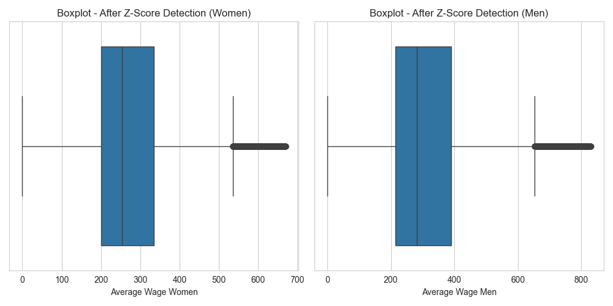

# Employment Salary Prediction

## About

- <strong>University: </strong>University of Prishtina
- <strong>Faculty: </strong>Faculty of Electrical and Computer Engineering
- <strong>Study Program: </strong>Master of Computer and Software Engineering
- <strong>Subject (1st year): </strong>Machine Learning taught by [Prof. Dr. Eng. Lule Ahmedi](https://staff.uni-pr.edu/profile/luleahmedi) and [PhD. c Mërgim Hoti](https://staff.uni-pr.edu/profile/m%C3%ABrgimhoti)
- <strong>Students:</strong> [Festina Qorrolli](https://github.com/festinaqorrolli) and [Fisnik Spahija](https://github.com/Fisinik/)

The goal of this [project](https://github.com/fisinik/employment-salary-prediction) is to predict the male/female employment salary based on the data provided by [Tax Administration of Kosovo](https://www.atk-ks.org/en/open-data/). This project is used for the Machine Learning course in University of Prishtina, Computer and Software Engineering.

## Instructions

This project requires venv environment. This can be done by creating a workspace environment through VScode. Make sure python and pip are installed.

Install kernel for the environment by running the following command in the terminal:

```bash
pip install ipykernel
```

Install the necessary packages.

```bash
pip install -r requirements.txt
```

## Phase 1 (Preparing the model)

### Dataset overview

#### Attributes (27):

- Viti Godina Year <strong>(categorical ordinal)</strong>
- "Muaji
  Mesec
  Month" <strong>(categorical ordinal)</strong>
- "PERSHKRIMI I SEKTORIT
  OPIS SEKTORA
  SECTOR DESCRIPTION" <strong>(categorical nominal)</strong>
- "Statusi i regjistrimit
  Status registracije Registration status" <strong>(categorical nominal)</strong>
- Komuna Opstina Municipality <strong>(categorical nominal)</strong>
- "Nr Tatimp
  Poreski obveznik
  Number of Taxpayers" <strong>(numerical discrete)</strong>
- "Nr Puns
  Broj zaposlenih
  Number of employees" <strong>(numerical discrete)</strong>
- Primar Primarna Primary <strong>(numerical discrete)</strong>
- Sekondar Sekundarna Secondary <strong>(numerical discrete)</strong>
- "Meshkuj
  Muskarci
  Men (M)." <strong>(numerical discrete)</strong>
- "Femra
  Zenske
  Women (F)" <strong>(numerical discrete)</strong>
- "Pa Verif
  Neprovereno
  Unverified" <strong>(numerical discrete)</strong>
- M 15-24 <strong>(numerical discrete)</strong>
- F 15-24 <strong>(numerical discrete)</strong>
- M 25-34 <strong>(numerical discrete)</strong>
- F 25-34 <strong>(numerical discrete)</strong>
- M 35-44 <strong>(numerical discrete)</strong>
- F 35-44 <strong>(numerical discrete)</strong>
- M 45-54 <strong>(numerical discrete)</strong>
- F 45-54 <strong>(numerical discrete)</strong>
- M 55-64 <strong>(numerical discrete)</strong>
- F 55-64 <strong>(numerical discrete)</strong>
- M 65+ <strong>(numerical discrete)</strong>
- F 65+ <strong>(numerical discrete)</strong>
- "Mesat. Pages
  Prosecna plata
  Average Wage" <strong>(numerical continuous)</strong>
- "Mesat. Meshk
  Prosecni M.
  Average M." <strong>(numerical continuous)</strong>
- "Mesat. Fem.
  Prosecni F. Average F." <strong>(numerical continuous)</strong>

#### Data integration

Our dataset is separated based on years of employment data on 5 CSV (Comma Separated Values) files. The files can be found on the link provided on the about section. Using pandas python package we have read and concatinated the 5 csv files into one dataframe "employment_combined".

#### Dataset Size

The resulting dataframe consists of <strong>88014 rows</strong> spaned through 5 years divided into <strong>27 attributes</strong> as described above.

#### Null values


### Dimension reduction and agreggation

Since the attributes are described in three languages, for simplicity's sake we have changed the column names to the corresponding English representation.

Noticing how columns "Men" and "Women" don't have an accurate summary of the age group columns, we have dropped the Men, Women columns and have added the accurate summaries from the age group columns.

Furthermore, columns such as Number of Taxpayers, Primary, Secondary, Unverified, Average wage, have been removed in the context of our objectives stated in the about section.

After these modifications our dataframe consists of the following columns:

- Year <strong>(categorical ordinal)</strong>
- Month <strong>(categorical ordinal)</strong>
- Month-Year <strong>(categorical ordinal)</strong>
- Sector Description <strong>(categorical nominal)</strong>
- Registration Status <strong>(categorical nominal)</strong>
- Municipality <strong>(categorical nominal)</strong>
- Number of Employees <strong>(numerical discrete)</strong>
- Men <strong>(numerical discrete)</strong>
- Women <strong>(numerical discrete)</strong>
- Average Wage Men <strong>(numerical continuous)</strong>
- Average Wage Women <strong>(numerical continuous)</strong>


### Data cleaning

By default values in columns "Average Wage Men" and "Average Wage Women" are NaN if there isn't a male/female employee in that instance. Therefore we fill these columns where values are missing with zeros only if the corresponding Men/Women column has zero value also.

After cleaning these columns our dataset consists of <strong>70611 cleaned rows</strong>.

### Discretization of "Registration Status" and "Sector Description"

As seen on the preprocessing file, we notice that column "Registration Status" has <strong>30 unique string values</strong> whereas 'Sector Description' has <strong>22 unique string values</strong>. We have created two new columns "Registration Id" and "Sector Id" to apply discretization of these columns.


### Anomaly Detection

Identifying anomalies can provide valuable insights into the data, below we can see the detection of them:


After applying Isolation Forest we can see the results clearly indicate a more consistent distribution.


We can see that Isolation Forest hasn't completely helped us counter the anomalies therefore we also use z-score to remove the remaining.



### Data Skewness

Based on the data skewness we can see that the skewness is positive.


Based on skewness we can deduct that most people earn less than the average wage, with a smaller number of people earning much higher.


### Correlation Matrix

Representation of correlation between attributes.


### SMOTE Algorithm

With SMOTE Algorithm we generate synthetic samples from the minority class (in this case where female wages are greater than male wages) to balance the dataset. This creates a more unbiased predictability performance.


### Splitting dataset into training and testing data

Attributes we consider on using for training model are:

- Sector Description
- Registration Status
- Municipality
- Average Wage Men
- Average Wage Women

Training set consists of <strong>42656 rows</strong>.

Testing set consists of <strong>18282 rows</strong>.

The files for testing and training can be found in /dataset:

- /dataset/testing_set.csv
- /dataset/training_set.csv

### Phase 2 (Training the model)

During training, the model learns patterns on the data related to the target variable.
It is therefore essential to analyze and compare the performance of the model against other algorithms to determine if further additional optimizations are needed.

We will analyze the training results of 7 different algorithms which are:

- Neural Network
- Logistic Regression
- Decision Tree Classifier
- Random Forest Classifier
- Support Vector Machine
- K Neighbors
- Gradient Boosting Classifier

We will evaluate different data splits such as 40/60, 30/70, 20/80, 10/90 using metrics like Accuracy, F1-score, Recall, and Precision.

- Accuracy: It measures the overall correctness of a model by comparing the number of correct predictions to the total number of predictions made. Mathematically, accuracy is calculated as (TP + TN) / (TP + TN + FP + FN), where TP is True Positives, TN is True Negatives, FP is False Positives, and FN is False Negatives.

- Recall (Sensitivity or True Positive Rate): It measures the ability of a model to correctly identify positive instances from all actual positive instances. It is calculated as TP / (TP + FN), where TP is True Positives and FN is False Negatives. High recall indicates that the model is good at minimizing false negatives.

- Precision: It measures the accuracy of positive predictions made by the model. It is calculated as TP / (TP + FP), where TP is True Positives and FP is False Positives. Precision is important when the cost of false positives is high.

- F1 Score: It is the harmonic mean of precision and recall, providing a balance between the two metrics. It is calculated as 2 _ (Precision _ Recall) / (Precision + Recall). F1 score is useful when there is an uneven class distribution, as it considers both false positives and false negatives.

### Neural Network

    Accuracy: Ranges from approximately 0.714 to 0.726 across different test ratios.
    Recall: Varies from around 0.706 to 0.807, indicating the proportion of actual positives correctly identified.
    Precision: Ranges from about 0.691 to 0.730, representing the proportion of predicted positives that are correct.
    F1 Score: Varies from approximately 0.716 to 0.747, which is the harmonic mean of precision and recall.

| Ratio | Accuracy | Recall | Precision | F1 Score |
| ----- | -------- | ------ | --------- | -------- |
| 40/60 | 0.721    | 0.706  | 0.730     | 0.718    |
| 30/70 | 0.726    | 0.807  | 0.696     | 0.747    |
| 20/80 | 0.720    | 0.801  | 0.691     | 0.742    |
| 10/90 | 0.714    | 0.720  | 0.712     | 0.716    |

### Logistic Regression

Performance: Consistently shows accuracy, recall, precision, and F1 scores around 0.647 across different test ratios, indicating stable but relatively lower performance compared to other models.

| Ratio | Accuracy | Recall | Precision | F1 Score |
| ----- | -------- | ------ | --------- | -------- |
| 40/60 | 0.647    | 0.669  | 0.642     | 0.655    |
| 30/70 | 0.647    | 0.669  | 0.642     | 0.655    |
| 20/80 | 0.647    | 0.669  | 0.642     | 0.655    |
| 10/90 | 0.647    | 0.669  | 0.642     | 0.655    |

### Decision Tree Classifier

Accuracy, Recall, Precision, F1 Score: Both models perform consistently well across different test ratios, with accuracy around 0.882 and other metrics like recall, precision, and F1 score around 0.867 to 0.895, indicating good overall performance.

| Ratio | Accuracy | Recall | Precision | F1 Score |
| ----- | -------- | ------ | --------- | -------- |
| 40/60 | 0.882    | 0.867  | 0.895     | 0.881    |
| 30/70 | 0.882    | 0.867  | 0.895     | 0.881    |
| 20/80 | 0.882    | 0.867  | 0.895     | 0.881    |
| 10/90 | 0.882    | 0.867  | 0.895     | 0.881    |

### Random Forest Classifier

Performance: SVM and K Neighbors show similar performance metrics across different test ratios, with accuracy around 0.704 and other metrics like recall, precision, and F1 score around 0.681 to 0.769, indicating moderate performance.

| Ratio | Accuracy | Recall | Precision | F1 Score |
| ----- | -------- | ------ | --------- | -------- |
| 40/60 | 0.882    | 0.871  | 0.891     | 0.881    |
| 30/70 | 0.881    | 0.872  | 0.889     | 0.880    |
| 20/80 | 0.883    | 0.875  | 0.890     | 0.882    |
| 10/90 | 0.883    | 0.874  | 0.890     | 0.882    |

### Support Vector Machine

| Ratio | Accuracy | Recall | Precision | F1 Score |
| ----- | -------- | ------ | --------- | -------- |
| 40/60 | 0.704    | 0.769  | 0.681     | 0.722    |
| 30/70 | 0.704    | 0.769  | 0.681     | 0.722    |
| 20/80 | 0.704    | 0.769  | 0.681     | 0.722    |
| 10/90 | 0.704    | 0.769  | 0.681     | 0.722    |

### K Neighbors

| Ratio | Accuracy | Recall | Precision | F1 Score |
| ----- | -------- | ------ | --------- | -------- |
| 40/60 | 0.862    | 0.857  | 0.866     | 0.862    |
| 30/70 | 0.862    | 0.857  | 0.866     | 0.862    |
| 20/80 | 0.862    | 0.857  | 0.866     | 0.862    |
| 10/90 | 0.862    | 0.857  | 0.866     | 0.862    |

### Gradient Boosting Classifier

Performance: Shows moderate performance with accuracy around 0.746 and other metrics like recall, precision, and F1 score around 0.738 to 0.766 across different test ratios.

| Ratio | Accuracy | Recall | Precision | F1 Score |
| ----- | -------- | ------ | --------- | -------- |
| 40/60 | 0.746    | 0.766  | 0.738     | 0.752    |
| 30/70 | 0.746    | 0.766  | 0.738     | 0.752    |
| 20/80 | 0.746    | 0.766  | 0.738     | 0.752    |
| 10/90 | 0.746    | 0.766  | 0.738     | 0.752    |

### Phase 3
